# abq-media — State Machine Diagrams

> Open this file in VS Code with the Mermaid extension to see live previews.
> Use `Cmd+Shift+V` (Mac) or `Ctrl+Shift+V` (Windows/Linux) to preview.

---

## 1. High-Level Transform Flow

```mermaid
flowchart TB
    subgraph INPUT["📥 Input Layer"]
        A[/"Source (URL, file, text)"/]
        A --> B{Detect Type}
        B -->|YouTube| YT[YouTube Adapter]
        B -->|Audio| AU[Audio Adapter]
        B -->|Text/File| TX[Text Loader]
        B -->|Idea| ID[Raw Text]
    end

    subgraph EXTRACT["🔄 Extraction"]
        YT --> TR[Transcription]
        AU --> TR
        TX --> PS[Processing Select]
        ID --> PS
        TR --> PS
    end

    subgraph PROCESS["⚙️ Processing"]
        PS -->|research| RP[Research Prompt Gen]
        PS -->|article| AG[Article Generate]
        PS -->|translate| TL[Translate]
        PS -->|script| SG[Script Generate]
        PS -->|raw| OUT
        
        RP --> RE[Research Execute]
        RE --> OUT
        AG --> OUT
        TL --> OUT
    end

    subgraph OUTPUT["📤 Output Layer"]
        OUT{Output Select}
        OUT -->|podcast| SG2[Script Generate]
        OUT -->|podcast-script| PKG
        OUT -->|video-script| VS[Video Script]
        OUT -->|article| PKG
        
        SG --> TTS[ElevenLabs TTS]
        SG2 --> TTS
        VS --> PKG
        TTS --> PKG[Package]
    end

    PKG --> DONE[/"✅ Project Complete"/]

    style INPUT fill:#e1f5fe
    style EXTRACT fill:#fff3e0
    style PROCESS fill:#f3e5f5
    style OUTPUT fill:#e8f5e9
```



---

## 2. State Machine (Detailed)


---

## 3. Recipe-Driven Stage Selection

```mermaid
flowchart LR
    subgraph RECIPES["📋 Recipes"]
        R1[default]
        R2[quick]
        R3[research-only]
        R4[article-nyt]
    end

    subgraph STAGES["🔧 Stages"]
        S1[transcript]
        S2[research-prompt]
        S3[research]
        S4[script]
        S5[tts]
        S6[article]
    end

    R1 -->|enables| S1
    R1 -->|enables| S2
    R1 -->|enables| S3
    R1 -->|enables| S4
    R1 -->|enables| S5

    R2 -->|enables| S1
    R2 -->|skips| S2
    R2 -->|skips| S3
    R2 -->|enables| S4
    R2 -->|enables| S5

    R3 -->|enables| S1
    R3 -->|enables| S2
    R3 -->|enables| S3
    R3 -->|skips| S4
    R3 -->|skips| S5

    R4 -->|enables| S1
    R4 -->|skips| S2
    R4 -->|skips| S3
    R4 -->|skips| S4
    R4 -->|skips| S5
    R4 -->|enables| S6

    style R1 fill:#4caf50,color:#fff
    style R2 fill:#ff9800,color:#fff
    style R3 fill:#2196f3,color:#fff
    style R4 fill:#9c27b0,color:#fff
```



---

## 4. Context Object Flow

```mermaid
flowchart TB
    subgraph CTX["PipelineContext"]
        direction TB
        META["📋 Meta
        ─────────────
        projectName
        projectDir
        currentState
        stateHistory[]"]
        
        INPUT["📥 Input
        ─────────────
        inputType?
        youtubeUrl?
        inputPath?
        rawText?"]
        
        PROC["⚙️ Processing
        ─────────────
        transcript?
        researchPrompt?
        report?
        article?"]
        
        OUT["📤 Output
        ─────────────
        podcastScript?
        videoScript?
        audioPath?
        outputFiles[]"]
    end

    S1[PROJECT_INIT] -->|sets projectName, projectDir| META
    S2[INPUT_SELECT] -->|sets inputType| INPUT
    S3[INPUT_YOUTUBE] -->|sets youtubeUrl| INPUT
    S4[TRANSCRIPTION] -->|sets transcript| PROC
    S5[RESEARCH_PROMPT_GEN] -->|sets researchPrompt| PROC
    S6[RESEARCH_EXECUTE] -->|sets report| PROC
    S7[SCRIPT_GENERATE] -->|sets podcastScript| OUT
    S8[TTS_ELEVENLABS] -->|sets audioPath| OUT
    S9[PACKAGE] -->|sets outputFiles, zipPath| OUT

    style CTX fill:#fafafa,stroke:#333
    style META fill:#e3f2fd
    style INPUT fill:#fff3e0
    style PROC fill:#f3e5f5
    style OUT fill:#e8f5e9
```



---

## 5. Error Recovery Flow


---

## 6. Command Flow


---

## VS Code Tips

### Keyboard Shortcuts
- `Cmd+Shift+V` — Preview markdown with Mermaid
- `Cmd+K V` — Side-by-side preview

### Export Options
1. **PNG/SVG**: Use [Mermaid Live Editor](https://mermaid.live) — paste code, export
2. **PDF**: Print from markdown preview
3. **In Docs**: GitHub/GitLab render Mermaid natively in README

### Recommended Settings
Add to `.vscode/settings.json`:
```json
{
  "markdown.mermaid.theme": "dark",
  "editor.quickSuggestions": {
    "strings": true
  }
}
```
