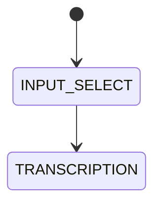

# Setup, Recipe, and Transform Guide

This guide covers the current CLI flow:
1) run setup,
2) create a custom recipe,
3) run transform.

# My Diagram

## Prerequisites

- Node.js `>=20`
- npm
- Repo cloned locally

From repo root, build the CLI package:

```bash
npm run build -w @abquanta/abq-media-cli
```

Use this local command in all examples:

```bash
abq-media
```

If you do not have it linked yet:

```bash
npm link -w @abquanta/abq-media-cli
```

## 1) Setup

First-time setup (interactive):

```bash
abq-media setup
```

This creates config at:
- `~/.abq-media/config.json`

Default projects directory:
- `~/abq-projects`

### Useful setup commands

Show current config:

```bash
abq-media setup --show
```

Update only API keys/providers:

```bash
abq-media setup --api
```

Update only defaults (language, recipe, output dir, voice):

```bash
abq-media setup --defaults
```

Update only organization:

```bash
abq-media setup --org
```

Reset and rerun full setup:

```bash
abq-media setup --reset
```

## 2) Create a Recipe

List built-in and custom recipes:

```bash
abq-media recipes list
```

Create a recipe interactively:

```bash
abq-media recipes create
```

Edit a custom recipe:

```bash
abq-media recipes edit <recipe-name>
```

Custom recipes are stored at:
- `~/.abq-media/recipes/<recipe-name>.yaml`

### Example custom recipe YAML

```yaml
name: my-fast-podcast
base: quick
version: 1
description: Fast podcast run with transcript + script + tts
stages:
  - name: transcript
    enabled: true
  - name: research-prompt
    enabled: false
  - name: research
    enabled: false
  - name: script
    enabled: true
  - name: tts
    enabled: true
```

## 3) Transform

Command shape:

```bash
abq-media transform <source> --into <format> [--using <recipe>] [--lang <code>] [--name <project-id>] [--output <dir>] [--dry-run]
```

Supported formats:
- `transcript`
- `research`
- `podcast`
- `podcast-script`
- `article`
- `translation`
- `video-script`

### Source examples

YouTube URL:

```bash
abq-media transform "https://www.youtube.com/watch?v=..." --into research
```

Audio file:

```bash
abq-media transform ./input.wav --into transcript
```

Text/markdown file:

```bash
abq-media transform ./notes.md --into article
```

### Recommended first run (safe)

Do a dry-run first to validate routing and metadata creation:

```bash
abq-media transform ./sample.txt --into transcript --using default --dry-run --name demo-project
```

Then run real execution:

```bash
abq-media transform ./sample.txt --into transcript --using default --name demo-project
```

## 4) Check, Continue, Re-run, Delete

List projects:

```bash
abq-media projects
```

Filter projects:

```bash
abq-media projects --status failed
abq-media projects --format podcast
```

Resume latest failed project:

```bash
abq-media projects continue
```

Resume a specific project:

```bash
abq-media projects continue <project-id>
```

Re-run a project (supports dry-run):

```bash
abq-media projects rerun <project-id> --dry-run
abq-media projects rerun <project-id>
```

Delete a project (non-interactive):

```bash
abq-media projects delete <project-id> --yes
```

## 5) Minimal End-to-End Example

```bash
# 1) setup once
abq-media setup

# 2) create recipe once
abq-media recipes create

# 3) run transform
abq-media transform ./packages/cli/samples/transcript.txt --into podcast --using my-fast-podcast --name my-first-podcast

# 4) inspect output
abq-media projects
abq-media projects open my-first-podcast
```

If a run fails:

```bash
abq-media projects continue
```

## 6) Troubleshooting transcription fallback

If YouTube fallback fails with an ASR short-transcript error, the minimum accepted transcript length is controlled by:

- `.abq-module.json` → `transcript.minLengthChars`
- default value: `40`

Example override:

```json
{
  "transcript": {
    "minLengthChars": 20
  }
}
```

For verbose provider-level diagnostics (including API failures and HTTP status in stage error messages), run with:

```bash
ABQ_DEBUG=1 abq-media transform <source> --into transcript
```

Each run also writes a pipeline log file inside the run output directory (for example `prep.log`) with stage progress/errors.
